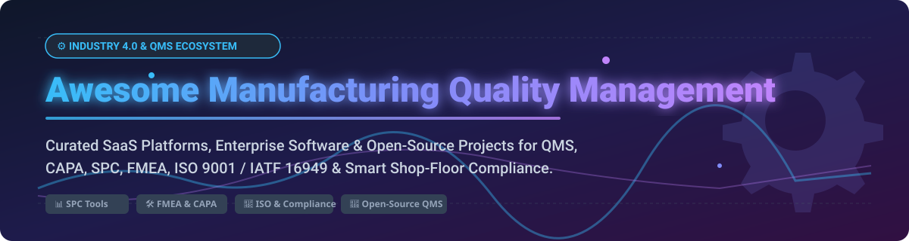

# ⚙️ Awesome Manufacturing Quality Management (QMS)

<p align="center">
  
</p>

<p align="center">
  <a href="https://github.com/ishandutta2007/Awesome-Awesome-Awesome"></a><a href="https://discord.gg/jc4xtF58Ve"></a>
  <a href="https://github.com/ishandutta2007/Awesome-Manufacturing-Quality-Management"></a>
  <a href="https://github.com/ishandutta2007/Awesome-Manufacturing-Quality-Management/network/members"></a>
  <a href="https://github.com/ishandutta2007/Awesome-Manufacturing-Quality-Management/blob/main/LICENSE"></a>
  <a href="https://github.com/ishandutta2007"></a>
</p>

---

## 🌟 Overview & Top Manufacturing Quality Management (QMS) Tools Ecosystem

A curated directory of **Enterprise SaaS Platforms** and **Open-Source GitHub Projects** for **Manufacturing Quality Management Systems (QMS)**, **Statistical Process Control (SPC)**, **Failure Mode & Effects Analysis (FMEA)**, **Corrective and Preventive Action (CAPA)**, **Non-Conformance Tracking (NCR)**, and **Regulatory Compliance (ISO 9001, IATF 16949, AS9100, ISO 13485, 21 CFR Part 11)**. 🏭✨

Whether you are a manufacturing engineer, quality director, plant manager, or software developer, this guide provides actionable comparisons and open-source building blocks to modernise shop-floor quality operations. 🛠️📈

---

## 📑 Table of Contents

* [🏢 Commercial & Enterprise SaaS Platforms](#-commercial--enterprise-saas-platforms)
* [🔓 Open-Source GitHub Projects](#-open-source-github-projects)
* [⚙️ Manufacturing ERP & MES Platforms with Quality Modules](#️-manufacturing-erp--mes-platforms-with-quality-modules)
* [📊 SPC & Statistical Quality Tools](#-spc--statistical-quality-tools)
* [⚠️ FMEA, Risk & Process Quality](#️-fmea-risk--process-quality)
* [🔍 Inspection, NCR & CAPA](#-inspection-ncr--capa)
* [📜 Quality Documentation & Compliance](#-quality-documentation--compliance)
* [🤖 Industrial IoT & Manufacturing Analytics](#-industrial-iot--manufacturing-analytics)
* [🏛️ Building an Open-Source Manufacturing QMS](#️-building-an-open-source-manufacturing-qms)
* [🔄 Commercial QMS → Open-Source Equivalents](#-commercial-qms--open-source-equivalents)
* [💡 Recommended Open-Source Stacks](#-recommended-open-source-stacks)
* [🤝 How to Contribute](#-how-to-contribute)
* [☕ Support & Sponsorship](#-support--sponsorship)
* [📈 Star History](#-star-history)
* [⚠️ Disclaimer](#️-disclaimer)

---

## 🏢 Commercial & Enterprise SaaS Platforms

> 📊 **Market Analysis & Size**: The global Quality Management Software (QMS) market is estimated at **$10.5 Billion to $12.8 Billion** (growing at a 9.8% CAGR). The market is **moderately fragmented**; while enterprise giants (SAP, Siemens, Oracle, Veeva) dominate large-scale multi-plant deployments, specialized mid-market SaaS vendors (MasterControl, Qualio, Greenlight Guru, ETQ Reliance) capture significant market share in regulated manufacturing verticals.

Below is a detailed comparison of leading enterprise QMS SaaS providers, sorted by company size and annual market presence. 🏢⚡

| Vendor / Product 🏢 | Market Scale & Company Size 🏢 | Estimated Starting Pricing 💵 | Free Tier / Free Trial Limits 🎁 | Primary Manufacturing & Quality Features 🛠️ |
| :--- | :--- | :--- | :--- | :--- |
| **[SAP Quality Management](https://www.sap.com/products/scm/quality-management.html)** | **$34.1B Annual Revenue** (~$160B+ Market Cap) | ~$1,800 / user / year (as part of S/4HANA ERP) | 14-day SAP Cloud trial (restricted sandbox access) | Enterprise QM, inspection lots, certificates, vendor evaluations, equipment calibration, multi-site traceability. |
| **[Oracle Quality Management](https://www.oracle.com/scm/manufacturing/quality-management/)** | **$53.0B Annual Revenue** (~$380B+ Market Cap) | ~$150 / user / month (~$1,800/yr) | 30-day Free Trial with $300 cloud credits | Quality collection plans, inspection disposition, shop-floor nonconformance, supply chain quality governance. |
| **[Siemens Opcenter Quality](https://www.sw.siemens.com/)** | **$85.0B Group Revenue** (Siemens AG) | ~$3,500 / license / year base | 30-day trial of Siemens Xcelerator Academy & cloud sandbox | Closed-loop quality, FMEA, SPC, APQP, PPAP, gauge management, supplier quality. |
| **[Veeva Vault QMS](https://www.veeva.com/products/vault-quality/)** | **$2.4B Annual Revenue** (~$32B Market Cap) | ~$15,000 / year base platform fee | No free version; 14-day custom guided sandbox trial available upon sales inquiry | Regulated Life Sciences QMS, document control, audit management, deviation tracking, electronic signatures. |
| **[ETQ Reliance (Hexagon)](https://www.etq.com/)** | **$5.4B Parent Revenue** (Hexagon AB) | ~$18,000 / year enterprise base | 14-day guided sandbox demo trial for qualified enterprise accounts | Enterprise CAPA, document control, audit management, change control, supplier quality, SCAR, risk matrix. |
| **[Sparta TrackWise Digital (Honeywell)](https://www.spartasystems.com/)** | **$36.6B Parent Revenue** (Honeywell) | ~$25,000 / year base enterprise license | No free version; 30-day enterprise pilot program upon inquiry | Highly regulated quality event management, CAPA, complaints, AI-assisted root cause analysis. |
| **[Plex Smart Manufacturing (Rockwell)](https://www.rockwellautomation.com/)** | **$9.0B Parent Revenue** (Rockwell Automation) | ~$20,000 / year base site subscription | No free tier; 30-day demonstration environment for manufacturing teams | Cloud MES & Quality, inline SPC, digital inspection sheets, lot traceability, checksheets. |
| **[MasterControl](https://www.mastercontrol.com/)** | **$150M+ ARR** (Enterprise Private) | ~$12,000 to $25,000 / year base tier | No free tier; 14-day interactive demo environment upon sales request | Manufacturing Excellence, digital work instructions, automated CAPA, audit trails, document control. |
| **[Intelex QMS](https://www.intelex.com/)** | **$100M+ ARR** (Industrial Scientific / Fortive) | ~$10,000 / year base tier | 14-day free trial on select EHS & Quality modules | EHS & QMS integration, supplier quality, audits, nonconformance reporting, document management. |
| **[ComplianceQuest](https://www.compliancequest.com/)** | **$50M+ ARR** (Salesforce Ecosystem) | ~$7,200 / year base (~$60/user/mo) | 30-day trial on Salesforce AppExchange | Built on Salesforce, QMS + EHS, supplier portal, inspection management, mobile audit apps. |
| **[SafetyCulture (iAuditor)](https://safetyculture.com/)** | **$100M+ ARR** ($1.7B Valuation) | $24 / user / month | Free Forever Plan (Up to 10 team members, 300 inspection submissions/mo) | Digital mobile checklists, shop-floor inspections, immediate issue reporting, corrective actions. |
| **[Greenlight Guru](https://www.greenlight.guru/)** | **$40M+ ARR** ($120M+ Funding) | ~$600 / user / month (~$7,200/yr) | No free tier; 14-day preview access for medical device teams | ISO 13485 QMS, MedTech design control, risk management (ISO 14971), CAPA, document control. |
| **[Qualio](https://www.qualio.com/)** | **$30M+ ARR** ($80M+ Funding) | ~$12,000 / year base platform | 14-day trial available for regulated quality teams upon consultation | Cloud QMS for emerging life science & medical device manufacturers, document management, training tracking. |
| **[QT9 QMS](https://qt9software.com/qms/)** | **$15M+ ARR** (Private) | ~$1,700 to $2,200 / year concurrent model | 30-day full-featured free trial with sample data | 23+ modules included, ERP integration, incoming inspection, calibration, vendor rating, CAPA. |
| **[Intellect QMS](https://www.intellectqms.com/)** | **$15M+ ARR** (Private) | ~$8,000 / year base package | 14-day custom sandbox trial | No-code compliant QMS platform, drag-and-drop workflow builder, mobile apps, audit management. |
| **[Harrington QMS](https://www.harrington-group.com/)** | **$10M+ ARR** (Private) | ~$1,200 / single user license | 30-day evaluation trial copy | Quality management software, document control, calibration, maintenance, corrective actions. |
| **[Tulip Frontline Operations](https://tulip.co/)** | **$25M+ ARR** ($150M+ Funding) | $1,200 / station / year ($100/mo) | 30-day full feature trial (1 station, unlimited apps) | No-code frontline operational apps, vision inspection, IoT shop-floor quality enforcement. |

---

## 🔓 Open-Source GitHub Projects

The open-source manufacturing quality software landscape is composed of specialized building blocks (Core QMS, ERP/MES with Quality Modules, SPC Engines, FMEA tools, and Industrial IoT frameworks).

Below are the top open-source projects, sorted by **GitHub Stars_Count (Descending)**. 🌟⚡

| Repository / Project 📦 | GitHub_Stars 🌟 | Primary Category 🏷️ | Core Description & Capabilities 🚀 |
| :--- | :--- | :--- | :--- |
| **[n8n-io/n8n](https://github.com/n8n-io/n8n)** | [](https://github.com/n8n-io/n8n/stargazers) | Workflow Automation | Fair-code workflow automation engine for routing shop-floor alerts, email approvals, CAPA escalations, and webhook integrations. |
| **[grafana/grafana](https://github.com/grafana/grafana)** | [](https://github.com/grafana/grafana/stargazers) | Quality Dashboards & Analytics | Visualisation platform for real-time shop-floor SPC control charts, OEE metrics, defect rates, and sensor telemetry. |
| **[apache/superset](https://github.com/apache/superset)** | [](https://github.com/apache/superset/stargazers) | Business Intelligence | Enterprise open-source BI & data exploration suite for manufacturing yield analysis, defect Pareto charts, and executive quality reporting. |
| **[odoo/odoo](https://github.com/odoo/odoo)** | [](https://github.com/odoo/odoo/stargazers) | ERP & Manufacturing | Modular open-source ERP foundation featuring work center control, manufacturing orders, and extensible quality check modules. |
| **[frappe/erpnext](https://github.com/frappe/erpnext)** | [](https://github.com/frappe/erpnext/stargazers) | Open-Source ERP & QMS | Full-featured open-source ERP with built-in Quality Inspections, Quality Action (CAPA), Quality Procedure, and Lot Traceability. |
| **[apache/kafka](https://github.com/apache/kafka)** | [](https://github.com/apache/kafka/stargazers) | Event Streaming | Distributed event stream backbone for streaming real-time machine telemetry, high-frequency inline quality checks, and event logs. |
| **[influxdata/influxdb](https://github.com/influxdata/influxdb)** | [](https://github.com/influxdata/influxdb/stargazers) | Time-Series Database | High-performance time-series data store for sensor metrics, industrial telemetry, dimensional measurement logs, and SPC data streams. |
| **[node-red/node-red](https://github.com/node-red/node-red)** | [](https://github.com/node-red/node-red/stargazers) | Industrial IoT Integration | Flow-based visual programming for wiring shop-floor PLCs, barcode scanners, digital calipers, and inspection sensors into QMS databases. |
| **[thingsboard/thingsboard](https://github.com/thingsboard/thingsboard)** | [](https://github.com/thingsboard/thingsboard/stargazers) | IoT Platform | Open-source IoT platform for device telemetry, temperature/vibration monitoring, predictive quality, and edge alarm triggers. |
| **[Documenso/documenso](https://github.com/Documenso/documenso)** | [](https://github.com/Documenso/documenso/stargazers) | Digital Signatures | Open-source e-signature platform suitable for signing engineering change orders, SOP approvals, and compliance sign-offs. |
| **[frappe/frappe](https://github.com/frappe/frappe)** | [](https://github.com/frappe/frappe/stargazers) | App Framework | Python/JS low-code Web Framework supporting custom quality audit applications, permissions, audit trails, and REST APIs. |
| **[quarto-dev/quarto-cli](https://github.com/quarto-dev/quarto-cli)** | [](https://github.com/quarto-dev/quarto-cli/stargazers) | Technical Documentation | Open-source publishing system for rendering versioned QMS manuals, SOPs, control plans, and compliance documentation. |
| **[crbnos/carbon](https://github.com/crbnos/carbon)** | [](https://github.com/crbnos/carbon/stargazers) | Open-Core ERP/MES/QMS | Modern open-core ERP/MES/QMS platform designed for complex electronics assembly, contract manufacturing, and lot tracking. |
| **[eclipse-kura/kura](https://github.com/eclipse-kura/kura)** | [](https://github.com/eclipse-kura/kura/stargazers) | Edge Gateway Framework | Industrial IoT edge framework connecting shop-floor hardware to cloud quality telemetry and monitoring. |
| **[s-pms/SPMS-Server](https://github.com/s-pms/SPMS-Server)** | [](https://github.com/s-pms/SPMS-Server/stargazers) | Smart MES & QMS | Smart Production Management System combining MES, ERP, and QMS for industrial manufacturing operations. |
| **[evolunis/openQMS](https://github.com/evolunis/openQMS)** | [](https://github.com/evolunis/openQMS/stargazers) | ISO 13485 QMS Scaffolding | MIT-licensed open-source quality management system documentation template for regulated ISO 13485 & 9001 compliance. |
| **[Open-Industry-System/OpenQMS](https://github.com/Open-Industry-System/OpenQMS)** | [](https://github.com/Open-Industry-System/OpenQMS/stargazers) | Dedicated Manufacturing QMS | Full-stack manufacturing QMS supporting IATF 16949, 8D/CAPA, AIAG-VDA 7-Step PFMEA, Control Plans, SPC (X̄-R), and SCAR. |
| **[saturnis-io/cassini](https://github.com/saturnis-io/cassini)** | [](https://github.com/saturnis-io/cassini/stargazers) | Dedicated SPC Engine | Open-source SPC platform offering real-time control charts, capability metrics (Cp, Cpk, Pp, Ppk), Gage R&R, and FAI log tracking. |
| **[zavora-ai/mcp-qms](https://github.com/zavora-ai/mcp-qms)** | [](https://github.com/zavora-ai/mcp-qms/stargazers) | AI QMS MCP Server | Open-source Model Context Protocol server exposing QMS tools for inspection, NCR, CAPA, lot release, and HACCP. |
| **[IridiumSoftware/OpenQMS](https://github.com/IridiumSoftware/OpenQMS)** | [](https://github.com/IridiumSoftware/OpenQMS/stargazers) | Git-Native QMS Generator | GitHub-native quality system generator compiling Markdown standards, requirements, and audit evidence into versioned QMS artifacts. |
| **[jackhale98/Tessera](https://github.com/jackhale98/Tessera)** | [](https://github.com/jackhale98/Tessera/stargazers) | Engineering Quality Data | Git-managed engineering & quality data model linking requirements, risks, tests, BOMs, tolerances, and quality events. |

---

## ⚙️ Manufacturing ERP & MES Platforms with Quality Modules

Many manufacturers integrate quality control directly into their shop-floor execution:

* **[ERPNext](https://github.com/frappe/erpnext)** — Open-source ERP featuring native Quality Inspection templates, Quality Procedures, and CAPA logs linked to purchase orders, work orders, and stock receipts.
* **[Carbon](https://github.com/crbnos/carbon)** — Modern open-core ERP/MES/QMS designed around multi-level BOMs, lot genealogy, and component traceability.
* **[Odoo Community](https://github.com/odoo/odoo)** — Extensible open-source ERP framework with work center checksheets, defect logs, and inventory hold rules.
* **[S-PMS](https://github.com/s-pms/SPMS-Server)** — Smart Production Management System combining shop-floor MES data collection with quality inspection workflows.

---

## 📊 SPC & Statistical Quality Tools

Statistical Process Control prevents defects before they occur by identifying special-cause variation 📉:

```text
Shop-Floor Measurements 📏 ──► Control Charts 📈 (X̄-R, I-MR) ──► Out-of-Control Check ⚠️ ──► Trigger NCR / CAPA 🚨
```

* **[Cassini](https://github.com/saturnis-io/cassini)** — Open-source SPC platform providing real-time control chart rules (Western Electric / Nelson), capability indices ($C_p, C_{pk}, P_p, P_{pk}$), and Gage R&R ANOVA analysis.
* **[OpenQMS](https://github.com/Open-Industry-System/OpenQMS)** — Built-in SPC module supporting variable and attribute control charts ($P, NP, C, U$).
* **Data Science Stack**:
  * **[Python](https://github.com/python/cpython)** + **[SciPy](https://github.com/scipy/scipy)** — Custom process capability scripts and hypothesis testing.
  * **[Pandas](https://github.com/pandas-dev/pandas)** & **[NumPy](https://github.com/numpy/numpy)** — Wrangling multi-sensor inline gauge datasets.
  * **[Matplotlib](https://github.com/matplotlib/matplotlib)** & **[Grafana](https://github.com/grafana/grafana)** — Visualizing real-time process limits on shop-floor monitors.

---

## ⚠️ FMEA, Risk & Process Quality

Failure Mode and Effects Analysis is critical for ISO 9001 and IATF 16949 automotive quality standards 🚗:

* **[OpenQMS](https://github.com/Open-Industry-System/OpenQMS)** — Supports AIAG-VDA 7-Step PFMEA / DFMEA, Action Priority (AP) matrix, automatic Control Plan generation, and Special Characteristic ($\nabla, \mathbf{C_k}$) tracking.
* **[Tessera](https://github.com/jackhale98/Tessera)** — As-code risk matrix linking engineering requirements directly to design failure modes and test verification steps.

---

## 🔍 Inspection, NCR & CAPA

Closed-loop non-conformance management ensures permanent root cause resolution 🔄:

```text
Incoming Inspection 📦 ──► Defect Logged (NCR) 🛑 ──► Containment Action 🚧 ──► 5-Why / Fishbone 🔍 ──► 8D CAPA 📝 ──► Verification ✅
```

* **[OpenQMS](https://github.com/Open-Industry-System/OpenQMS)** — Complete 8D CAPA solver, Supplier Corrective Action Requests (SCAR), Incoming Quality Control (IQC), and Customer Complaint RMA management.
* **[QMS MCP Server](https://github.com/zavora-ai/mcp-qms)** — Model Context Protocol endpoint enabling AI assistants to inspect batch records, generate NCR summaries, and check CAPA verification status.

---

## 📜 Quality Documentation & Compliance

Controlling SOPs, work instructions, engineering change orders, and audit evidence:

* **[Open QMS (IridiumSoftware)](https://github.com/IridiumSoftware/OpenQMS)** — Git-native QMS documentation builder converting Markdown/YAML into versioned PDF compliance manuals with clause traceability matrices.
* **[Documenso](https://github.com/Documenso/documenso)** — Self-hosted digital signature engine for 21 CFR Part 11 compliant sign-offs.
* **[Quarto](https://github.com/quarto-dev/quarto-cli)** — Automated publishing engine for printing technical work instructions and quality standard operating procedures.

---

## 🏛️ Building an Open-Source Manufacturing QMS

You can assemble a robust enterprise-grade QMS stack using modular open-source microservices 🏗️:

```text
┌─────────────────────────────────────────────────────────────────────────┐
│                        PRESENTATION & DASHBOARDS                        │
│                   Grafana Dashboards • React QMS Portal                 │
└────────────────────────────────────┬────────────────────────────────────┘
                                     │
┌────────────────────────────────────▼────────────────────────────────────┐
│                             QMS CORE ENGINE                             │
│       OpenQMS (CAPA/FMEA) • ERPNext (Inspections) • Cassini (SPC)       │
└────────────────────────────────────┬────────────────────────────────────┘
                                     │
┌────────────────────────────────────▼────────────────────────────────────┐
│                    INTEGRATION & TELEMETRY LAYER                        │
│           Node-RED (PLC/Sensors) • Apache Kafka • n8n Workflows          │
└────────────────────────────────────┬────────────────────────────────────┘
                                     │
┌────────────────────────────────────▼────────────────────────────────────┐
│                             STORAGE LAYER                               │
│           PostgreSQL (Records) • InfluxDB (Time-Series Metrics)         │
└─────────────────────────────────────────────────────────────────────────┘
```

---

## 🔄 Commercial QMS → Open-Source Equivalents

| Enterprise Commercial QMS 💼 | Open-Source Modular Equivalent 🔓 |
| :--- | :--- |
| **ETQ Reliance** | OpenQMS + ERPNext + Grafana + n8n |
| **MasterControl** | Open QMS (Git) + Documenso + ERPNext + OpenQMS |
| **QT9 QMS** | ERPNext + OpenQMS + Cassini |
| **Qualio** | Open QMS + Frappe + Documenso |
| **Greenlight Guru** | Open QMS + Tessera + Quarto |
| **Siemens Opcenter Quality** | Cassini + OpenQMS + Node-RED + Grafana |
| **SafetyCulture / iAuditor** | ERPNext Mobile + n8n + Superset |

---

## 💡 Recommended Open-Source Stacks

* **Stack A (Full Automotive IATF 16949 Compliance)**: `OpenQMS` + `PostgreSQL` + `Grafana` + `n8n`
* **Stack B (ERP Integrated Manufacturing Quality)**: `ERPNext` + `Frappe Framework` + `Documenso`
* **Stack C (Shop-Floor Real-Time SPC)**: `Cassini` + `InfluxDB` + `Node-RED` + `Grafana`
* **Stack D (GitOps As-Code Medical / Aerospace QMS)**: `Open QMS` + `GitHub Actions` + `Documenso` + `Quarto`

---

## 🤝 How to Contribute

Contributions are warmly welcomed! 💖
1. Fork the Repository 🍴
2. Create your Feature Branch (`git checkout -b feature/awesome-qms-addition`)
3. Commit your changes (`git commit -m 'Add new open-source SPC project'`)
4. Push to the Branch (`git push origin feature/awesome-qms-addition`)
5. Open a Pull Request 🚀

---

## ☕ Support & Sponsorship

If you find this repository helpful for your manufacturing quality operations or engineering research, please consider supporting the project! ⭐

* **Star the Repo**: Click the ⭐ button at the top right!
* **Share**: Share with your fellow manufacturing & quality engineers.
* **Sponsor**: Buy me a coffee via [GitHub Sponsors Dashboard](https://github.com/sponsors/ishandutta2007) ☕✨

---

## 📈 Star History

[](https://star-history.dera.page/#ishandutta2007/Awesome-Manufacturing-Quality-Management&type=date&legend=top-left)

---

## ⚠️ Disclaimer

* This repository is a community-curated collection intended for educational and research purposes.
* Implementing software in regulated environments (ISO 9001, IATF 16949, AS9100, ISO 13485, 21 CFR Part 11) requires formal Computer Software Validation (CSV / CSA).
* Always consult with certified quality auditors and regulatory counsel prior to production deployment. ⚖️
